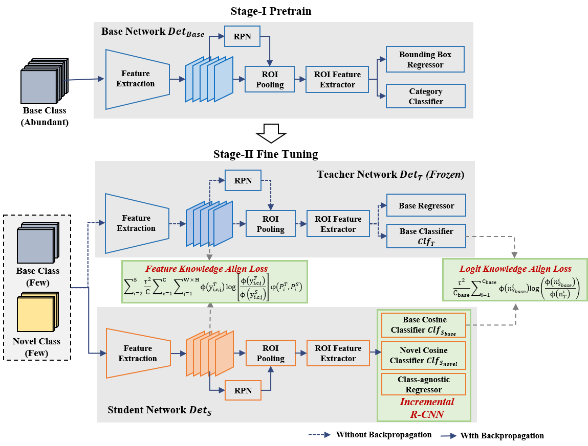
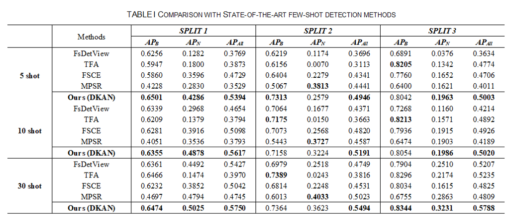
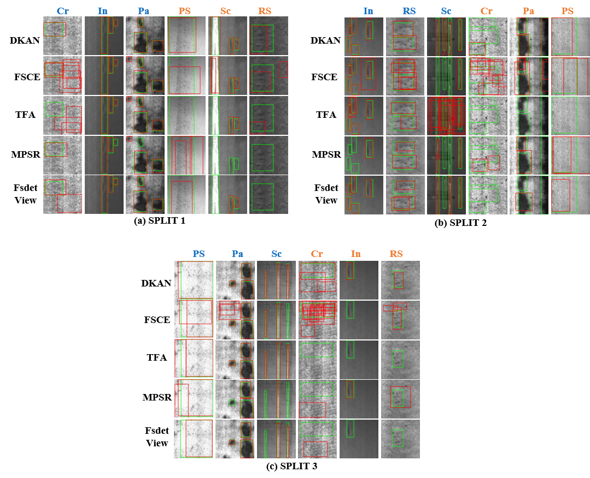

## A New Knowledge Distillation Network for Incremental Few-Shot Surface Defect Detection

This is the Pytorch inplementation of our paper:

**A New Knowledge Distillation Network for Incremental Few-Shot Surface Defect Detection** Chen Sun, Liang Gao, Xinyu Li and Yiping Gao  [[arxiv]](https://arxiv.org/abs/2209.00519) 



### Abstract

Surface defect detection is one of the most essential processes for industrial quality inspection. Deep learning-based surface defect detection methods have shown great potential. However, the well-performed models usually require large training data and can only detect defects that appeared in the training stage. When facing incremental few-shot data, defect detection models inevitably suffer from catastrophic forgetting and misclassification problem. To solve these problems, this paper proposes a new knowledge distillation network, called Dual Knowledge Align Network (DKAN). The proposed DKAN method follows a pretraining-finetuning transfer learning paradigm and a knowledge distillation framework is designed for fine-tuning. Specifically, an Incremental RCNN is proposed to achieve decoupled stable feature representation of different categories. Under this framework, a Feature Knowledge Align (FKA) loss is designed between class-agnostic feature maps to deal with catastrophic forgetting problems, and a Logit Knowledge Align (LKA) loss is deployed between logit distributions to tackle misclassification problems. Experiments have been conducted on the incremental Few-shot NEU-DET dataset and results show that DKAN outperforms other methods on various few-shot scenes, up to 6.65% on the mean Average Precision metric, which proves the effectiveness of the proposed method.

### Installation

#### Prerequisites

* PyTorch == 1.9 

* TorchVision==0.10.0
- MMFewshot == 0.1.0

- MMRazor==0.2.0

- MMCV-full ==1.4.6

### Installation

```shell
pip install torch==1.9.0+cu111 torchvision==0.10.0+cu111 torchaudio==0.9.0 -f https://download.pytorch.org/whl/torch_stable.html
pip install mmcv-full==1.4.6 -f https://download.openmmlab.com/mmcv/dist/cu111/torch1.9.0/index.html
mkdir ./packages
cd ./packages
git clone git@github.com:open-mmlab/mmdetection.git
git clone git@github.com:open-mmlab/mmfewshot.git
git clone git@github.com:open-mmlab/mmrazor.git

cd ./mmdetection
pip install -r requirements.txt
python setup.py develop

cd ../mmfewshot
pip install -r requirements.txt
python setup.py develop

cd ../mmrazor
pip install -r requirements.txt
python setup.py develop
```

### Data Preparation

Dwonload the NEU-DET dataset from the [[Link]](https://www.kaggle.com/datasets/kaustubhdikshit/neu-surface-defect-database) and put them in the `./dataset/images` directory.  We use random seed 1~10 to generate the few-shot split label which can be found in  `./dataset/fewshot-split` . You can also use `prepare_neu-det_voc_fewshot.py` to generate your own few-shot split.

```
dataset
├── annotations
├── fewshot_split
└── images
```

### Train

```
CUDA_VISIBLE_DEVICES=0,1 bash ./tools/dist_train.sh \
    ./configs/distill/split_1/dkan_5shot_fine_tuning.py \
    2 \
    --work-dir ./work_dir
```

### Test

```
CUDA_VISIBLE_DEVICES=0,1 bash ./tools/dist_test.sh \
    ./configs/distill/split_1/dkan_5shot_fine_tuning.py \
    ./work_dir/$YOU_CHECKPOINT_PATH
    2 \
    --work-dir ./work_dir \
    --eval_only
```

### Comparison





### Citation

```
@article{sun2022new,
  title={A New Knowledge Distillation Network for Incremental Few-Shot Surface Defect Detection},
  author={Sun, Chen and Gao, Liang and Li, Xinyu and Gao, Yiping},
  journal={arXiv preprint arXiv:2209.00519},
  year={2022}
}
```
